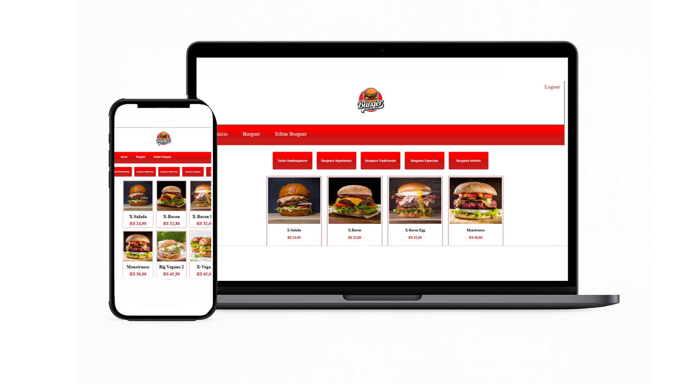

# 🍔 Projeto Hamburgueria

Sistema de gerenciamento para uma hamburgueria, desenvolvido com foco em administração de produtos, cardápio e pedidos. O projeto conta com páginas para exibir, adicionar, editar e excluir hambúrgueres.

## 📸 Demonstração

## 🚀 Funcionalidades

- Listagem de hambúrgueres disponíveis
- Cadastro de novos hambúrgueres (nome, descrição, imagem, preço)
- Edição de hambúrgueres já cadastrados
- Exclusão de itens do cardápio
- Interface responsiva para desktop e mobile
- Integração com banco de dados MySQL

## 🛠️ Tecnologias Utilizadas

- HTML5
- CSS3
- JavaScript
- PHP
- MySQL
- Git & GitHub
- Hospedagem: InfinityFree

## 🌐 Acesse o projeto online

👉 [Clique aqui para acessar](https://danielguimaraes.infinityfree.me)
